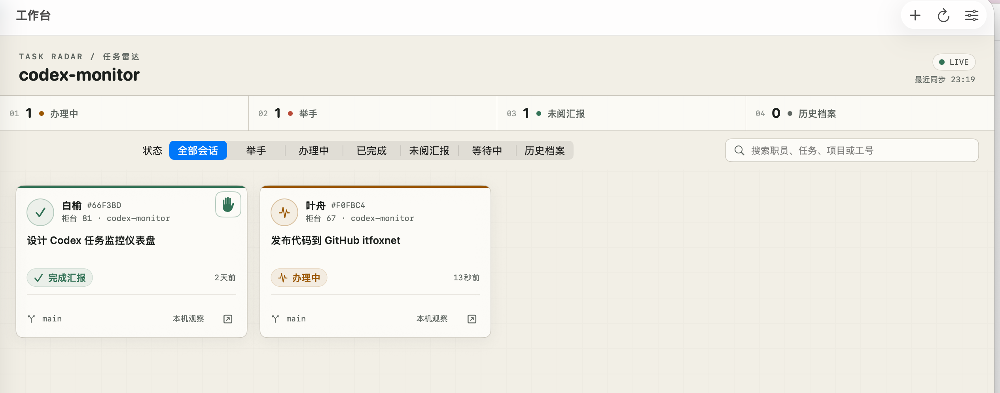
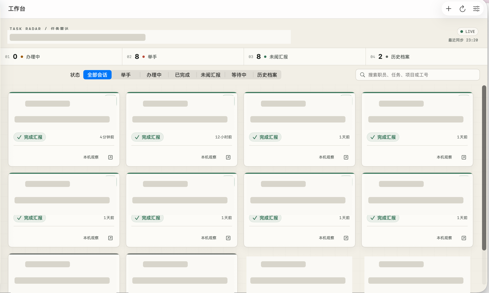

# Codex Monitor

一个以项目为单位的轻量 Codex 任务监控产品。当前目录保留 Web 视觉原型；正式方向已经确定为 SwiftUI 原生 macOS 菜单栏应用。

## 界面预览

项目级任务雷达，集中查看办理中、需处理、未阅汇报与历史档案：



多项目、多任务总览，支持按状态筛选、搜索与排序：



## 项目状态

- 当前：SwiftUI 本地 Alpha 已实现并打包，采用“托管 App Server + 本机会话生命周期观察”的双通道状态方案。
- 已验证：26 项自动化测试、真实 App Server 只读握手、Codex 原生状态对账、原生 1180×760 / 900×620 界面、幂等重连和 ad-hoc 签名应用包。
- MVP 原则：工作台托管任务提供权威状态和审批；其他本机 Codex 会话只读观察办理、完成、失败和中止；不使用 Hook。
- 发布前剩余：会产生模型用量的真实任务 E2E、长稳/多版本矩阵、Developer ID 签名、公证和 Beta。

完整文档从 [`docs/README.md`](docs/README.md) 开始；可执行工作项位于 [`TASKS.md`](TASKS.md)。

## 运行原生客户端

```bash
cd Native/CodexMonitor
swift test
sh Scripts/build-app.sh
open ".build/app/Codex Monitor.app"
```

详细使用、诊断和安全边界见 [`Native/CodexMonitor/README.md`](Native/CodexMonitor/README.md) 与 [`docs/06-LOCAL-ALPHA-ACCEPTANCE.md`](docs/06-LOCAL-ALPHA-ACCEPTANCE.md)。

## Web 原型当前能力

- 项目切换与项目级完成率
- 进行中、已完成、等待中、需处理四类状态
- 双列/三列会话卡片、搜索与组合筛选
- 卡片单击查看工作单，双击或右下角按钮直接打开对应 Codex 原生会话
- “经理—Codex 职员”管理隐喻与职员工牌
- 完成汇报、授权申请两种举手信号
- 会话详情、经理审批授权、暂停与恢复交互
- 桌面和移动端自适应布局

## 运行 Web 原型

直接打开 `index.html`，或在当前目录启动任意静态文件服务：

```bash
python3 -m http.server 4173
```

然后访问 `http://127.0.0.1:4173/`。

当前数据位于 `app.js` 顶部的 `projects` 和 `sessions` 数组中，是用于展示界面的示例数据。该原型仅作为 SwiftUI 正式客户端的视觉和交互参考，不再直接演进为生产架构。

## 实时数据边界

- `SERVER` 职员：由 Codex Monitor 所属 App Server 创建或接管，状态与审批均为权威数据。
- `OBSERVED` 职员：从本机 Codex rollout 日志的生命周期信封只读识别办理、完成、失败和中止；不读取或保存消息、命令输出和 diff，也不能代替原客户端处理授权。
- `ARCHIVE` 档案：没有新鲜活动信号的其他 Codex 会话。未正常结束但 10 分钟没有日志更新的记录自动回到档案，避免旧任务长期误报“办理中”。
- 授权处理：工作台响应同一 App Server 发出的当前请求；禁止自动批准和长期允许。
- Hook：不安装、不读取、不作为产品依赖。

## 退出客户端

从菜单栏面板点击电源图标，或从“Codex Monitor”菜单选择“退出 Codex Monitor”；也可以按 `⌘Q`。若仍有工作台托管任务正在办理，退出前会要求确认是否中断。
