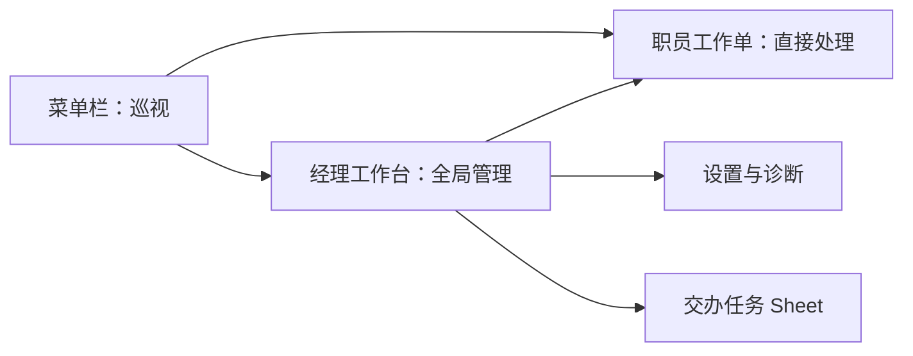
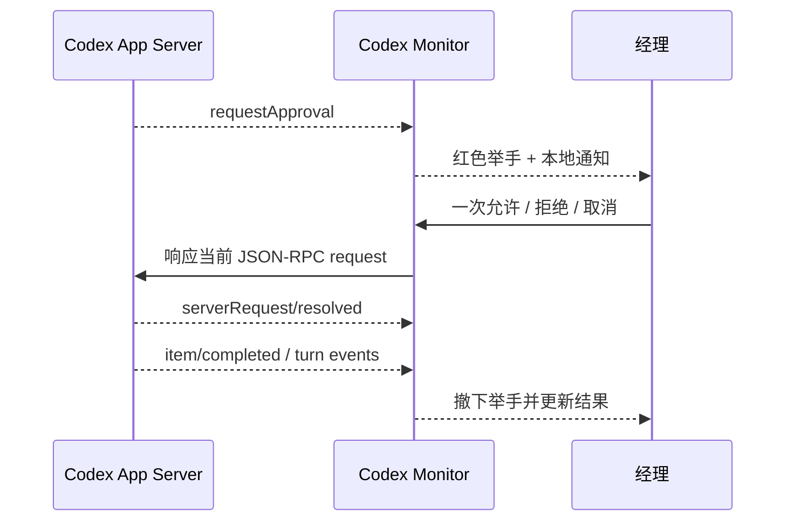

# Codex Monitor 产品与体验设计

## DESIGN SPECIFICATION

### 1. Purpose Statement

Codex Monitor 服务于同时管理多个 Codex 项目和任务的用户。界面必须先回答“谁在等我处理”，再回答“其他人进展如何”，并以紧凑、常驻、不打断开发工作的方式呈现。

### 2. Aesthetic Direction

**Industrial / utilitarian**。视觉隐喻来自安静的银行营业厅和值班调度台：项目是部门，Codex 任务是有工牌和柜台号的职员，用户是经理。风格克制、精确、有秩序，不使用卡通人物或装饰性拟物。

### 3. Color Palette

| 角色 | 色值 | 用途 |
|---|---|---|
| Ink | `#1D211E` | 主文字、深色顶栏、选中态 |
| Warm Paper | `#F2EFE6` | 窗口背景、项目轨道 |
| Porcelain | `#FCFBF7` | 卡片、弹层、输入区域 |
| Report Green | `#347357` | 完成汇报、在线、成功 |
| Raise Red | `#B84A38` | 授权申请、失败、必须处理 |

运行中使用系统橙色语义但降低饱和度；未知状态使用中性灰，不引入新的品牌色。所有状态同时使用形状、文字和 SF Symbol，不能只依赖颜色。

### 4. Typography

- **Manrope**：界面标题、正文、按钮和状态标签。
- **IBM Plex Mono**：任务编号、柜台号、分支、时长、时间戳和诊断信息。
- 动态字体尺寸遵循 macOS 辅助功能设置；若自定义字体不可用，回退策略由无障碍测试确认，不能造成文字截断。

### 5. Layout Strategy

主窗口采用不对称双区布局：左侧为固定窄项目轨道，右侧为弹性职员面板。任务卡使用紧凑砖块排布；“举手”标记从卡片右上边界向外突出，形成可扫描的非矩形轮廓。菜单栏面板只呈现总数、待处理队列和最近完成，不复制完整主窗口。

### 6. Platform

- 正式产品：SwiftUI 原生 macOS 应用。
- 入口：MenuBarExtra + 可独立调整大小的主窗口。
- 图标：统一使用 SF Symbols。
- 当前 Web 原型：仅作为概念和视觉参考。

## 1. 体验模型

### 1.1 角色映射

| 技术对象 | 界面称呼 | 说明 |
|---|---|---|
| 用户 | 经理 | 负责交办、巡视、审批和确认完成 |
| `cwd` 归并后的项目 | 项目部门 | 左侧项目单位 |
| Codex thread/task | 职员 | 一张紧凑职员卡 |
| thread id | 工号 | 仅显示短编号，详情可复制完整值 |
| active turn | 正在办理 | 当前任务活动 |
| approval request | 举手申请 | 红色手势标记，需要经理行动 |
| completed turn | 完成汇报 | 绿色手势标记，需要经理确认已阅 |
| system error / failed turn | 异常汇报 | 红色警示，与授权申请文案区分 |

人格化称呼不能遮蔽技术含义。例如卡片显示“举手申请”，详情同时显示“等待命令执行授权”。

### 1.2 用户注意力层级

从高到低固定为：

1. 授权申请。
2. 失败或系统错误。
3. 完成但未查看。
4. 运行中。
5. 等待中。
6. 已完成且已查看。
7. 状态未知。

同一层级内按状态更新时间倒序排列。用户可切换为“按项目固定顺序”，但默认优先保护注意力。

## 2. 信息架构

产品最多包含四个一级界面：

1. **菜单栏面板**：快速巡视和进入待处理任务。
2. **经理工作台**：项目分组、所有职员卡、筛选和批量已阅。
3. **职员工作单**：单个任务详情、状态来源和事件时间线。
4. **设置与诊断**：Server、通知、隐私、版本和审批审计。

“交办任务”使用主窗口 sheet，不增加一级界面；“全部会话”默认混排托管职员、本机观察会话与历史档案，并通过清晰的 `SERVER` / `OBSERVED` / `ARCHIVE` 标记区分；“历史档案”可用于单独筛选。

卡片单击用于选中并打开工作单；卡片右下角外跳按钮、双击卡片和工作单中的“在 Codex 中打开”统一调用官方 `codex://threads/<thread-id>` 深链接。无合法 UUID、无链接处理客户端或打开失败时留在工作台并显示可操作提示。



## 3. 菜单栏面板

### 3.1 目标

不打开主窗口即可回答三个问题：

- 当前有多少任务在运行？
- 有多少职员正在举手？
- 最近完成的是谁？

### 3.2 布局

建议宽度 360 pt，高度按内容在 280–520 pt 之间变化。

```text
┌ Codex Monitor ─────────────── 在线 ┐
│ 3 办理中     2 举手     1 刚完成   │
├ 需要你处理 ───────────────────────┤
│ [红手] 陈序 · 请求命令授权      > │
│ [红手] 周衡 · 任务执行失败      > │
├ 最近汇报 ─────────────────────────┤
│ [绿手] 林简 · 测试已通过        > │
├───────────────────────────────────┤
│ 打开经理工作台       设置…        │
└───────────────────────────────────┘
```

### 3.3 菜单栏图标

- 无待处理：线性办公台图标。
- 有待处理：右上角小圆点；1–9 显示数字，超过 9 显示 `9+`。
- 断线或未知：图标降低对比度并带斜线，不使用红点冒充待处理。
- 菜单栏本身不播放循环动画。

## 4. 经理工作台

### 4.1 窗口结构

- 最小尺寸：900 × 600 pt。
- 推荐尺寸：1180 × 760 pt。
- 左项目轨道：220 pt，可折叠到 64 pt。
- 右主区：顶部状态带 + 筛选带 + 自适应职员面板。
- 主窗口记忆尺寸、位置、项目选择和筛选，但不记忆敏感搜索内容。

### 4.2 顶部状态带

只展示四个数字：运行中、举手、完成未阅、状态未知。项目总数放在标题副文案，不再使用占据大量高度的五栏统计横幅。

待处理摘要以一行红色行动带出现：

```text
2 位职员正在举手  ·  1 项授权申请，1 项异常汇报       [只看举手]
```

### 4.3 项目轨道

每个项目条目包含：

- 项目名。
- 运行数与举手数。
- 细进度线。
- 状态圆点。

项目名来自目录名称，允许用户在应用内设置仅本地显示的别名。路径默认折叠，悬停或详情页才显示。

### 4.4 职员卡

标准卡片建议高度 148 pt，宽度随窗口形成 2–4 列。卡片不是完整任务日志，只保留：

- 职员名、工号、柜台号。
- 任务标题，最多两行。
- 所属项目与分支。
- 当前状态和最近活动。
- 持续时间、更新时间。
- 一条可选的进度/活动指示线。

职员名不是 Codex 数据，而是由 thread id 稳定映射出的本地称呼；同一任务始终使用同一名字。详情必须同时提供真实任务标题和 thread id，避免拟人化造成识别混乱。

### 4.5 举手表现

- **授权申请**：红色手势标记突出卡片右上边缘，卡片顶部有 3 pt 红条；只在首次出现时做一次 180 ms 抬起动画。
- **完成汇报**：绿色手势标记，外观较授权申请弱一级。
- **失败汇报**：红色三角警示，不和授权申请共用手势文案。
- 减少动态效果开启时，所有位移动画变为淡入。

### 4.6 筛选与搜索

筛选项：全部会话、举手、办理中、已完成、等待中、历史档案。搜索覆盖任务标题、项目名、本地职员名、短工号和分支。

键盘操作：

- `⌘K` 聚焦搜索。
- `⌘1…⌘5` 切换主要状态筛选。
- `↑/↓/←/→` 在卡片间移动焦点。
- `Return` 打开工作单。
- `⌘⇧A` 将当前项目的完成汇报标为已阅；必须显示撤销提示。

## 5. 职员工作单

详情采用右侧 inspector 或独立辅助窗口，取决于主窗口宽度。内容分四段：

1. **身份**：职员名、真实任务标题、工号、项目。
2. **状态**：产品状态、Codex 原始状态、数据来源、最后同步时间。
3. **当前事项**：授权原因、失败摘要或最后活动；敏感命令默认折叠。
4. **时间线**：任务开始、工具事件、授权申请、授权解决、完成/失败。

工作单的主行动由当前事项决定：待授权时显示“一次允许 / 拒绝 / 取消”，待补充信息时显示回答控件，完成时显示“确认已阅”。没有待处理事项时只显示状态和最小结果摘要。

审批区域遵循以下规则：

- 只展示 App Server 当前 request 明确允许的决定。
- 命令、目录、文件范围和授权原因默认安全折叠，可由用户展开。
- “一次允许”与长期允许不可混淆；MVP 不提供长期允许。
- 已解决、断线前或连接代次不匹配的请求显示为过期，所有按钮禁用。

## 6. 核心流程

### 6.1 首次启动

1. 应用检测 Codex 可执行文件和版本。
2. 展示“工作台托管任务”的范围、审批责任和本地数据说明。
3. 启动本地 stdio App Server，不改变 Codex 全局配置。
4. 请求通知权限；用户跳过后仍可使用工作台。
5. 默认显示工作台托管任务和独立原生任务；独立任务有新鲜活动时标记 `OBSERVED`，否则进入“历史档案”。

### 6.2 交办任务

1. 经理点击“交办任务”。
2. 选择项目目录，输入目标，选择模型和安全预设。
3. 工作台调用 `thread/start` 和 `turn/start`，立即创建职员卡。
4. 任务开始执行；若需要权限或信息，职员卡举手。

接管历史任务使用独立入口，并在确认前解释：未接管时只同步生命周期，授权仍需回原 Codex 客户端；只有接管后的新 turn 由工作台管理和审批。

### 6.3 工作台处理授权



发送决定后，按钮立即进入“正在提交”；只有收到 resolved 或最终 item 后才显示处理结果。断线时不重放旧决定，也不允许对缓存 request 作答。

### 6.4 断线恢复

1. 立即保留最后已知卡片，但加“状态可能已过期”。
2. 采用退避重连，不弹出重复系统通知。
3. 重连后先取全量快照，再恢复工作台登记的托管任务。
4. 断线前未解决的 request 全部标为过期；只有新连接重新发送的 request 才可处理。
5. 只为重连后仍然有效的新事项补发一次通知。

### 6.5 完全退出

菜单栏面板常驻显示电源图标，应用菜单提供“退出 Codex Monitor”，并支持 `⌘Q`。若仍有工作台托管职员正在办理，退出页必须明确显示数量和影响。默认按钮是“返回工作台”；只有用户选择“中断并退出”后，应用才请求中断 active turn 并关闭 Server。关闭主窗口不等于退出。

## 7. 通知策略

默认通知：

- 新授权申请：立即通知。
- 任务失败：立即通知。
- 任务完成：聚合 10 秒后通知，避免短时间内连续弹窗。

通知正文默认显示本地职员名、项目别名和状态，不显示完整命令、绝对路径或对话内容。点击通知打开对应工作单；任务已解决时打开最新状态，不重放旧申请。

## 8. 空、错、未知状态

| 场景 | 主文案 | 行动 |
|---|---|---|
| 尚无任务 | “大厅里还没有职员” | 交办任务 |
| Codex 未安装 | “没有找到 Codex” | 选择可执行文件 / 查看安装说明 |
| 版本不兼容 | “当前 Codex 版本暂不兼容” | 查看诊断、复制版本信息 |
| 连接中断 | “与职员大厅失去联系” | 自动重连 / 手动重试 |
| 状态冲突 | “这名职员的状态待核实” | 查看来源和最后同步时间 |
| 权限受限 | “只能读取部分任务” | 查看隐私与权限说明 |
| 非托管观察 | “正在观察其他 Codex 客户端” | 回原客户端处理 / 接管并继续 |
| 非托管历史 | “这是一份档案，不是正在办理的职员” | 接管并继续 / 仅查看 |
| 审批已过期 | “这项请示已失效” | 等待重新同步 |

错误信息必须描述用户能做什么，不能直接展示底层 JSON-RPC 堆栈。

## 9. 无障碍与本地化

- VoiceOver 读法示例：“陈序，Codex Monitor 项目，举手申请命令授权，3 分钟前。”
- 所有卡片、筛选和详情支持完整键盘操作。
- 状态色对比符合 WCAG AA；举手同时有图标和文字。
- 支持减少动态效果、增加对比度和动态字体。
- MVP 提供简体中文；字符串必须从第一天起本地化，英文作为开发回退语言。
- 时间使用系统区域设置，诊断日志统一采用 ISO 8601。

## 10. 设计验收清单

- [ ] 菜单栏面板能在 3 秒内识别待处理数。
- [ ] 900 × 600 pt 下仍可完成所有核心操作。
- [ ] 100 个任务下卡片密度可用，无统计大横幅挤占空间。
- [ ] 红色授权申请、红色失败、绿色完成在颜色之外仍可区分。
- [ ] 举手动画仅播放一次，减少动态效果时无位移。
- [ ] 所有图标来自 SF Symbols，无 Emoji 图标。
- [ ] 字体、色板、间距和状态语义与本文档一致。
- [ ] VoiceOver、键盘和高对比度模式通过人工验收。
- [ ] 隐私模式下不显示路径、命令和任务预览。
