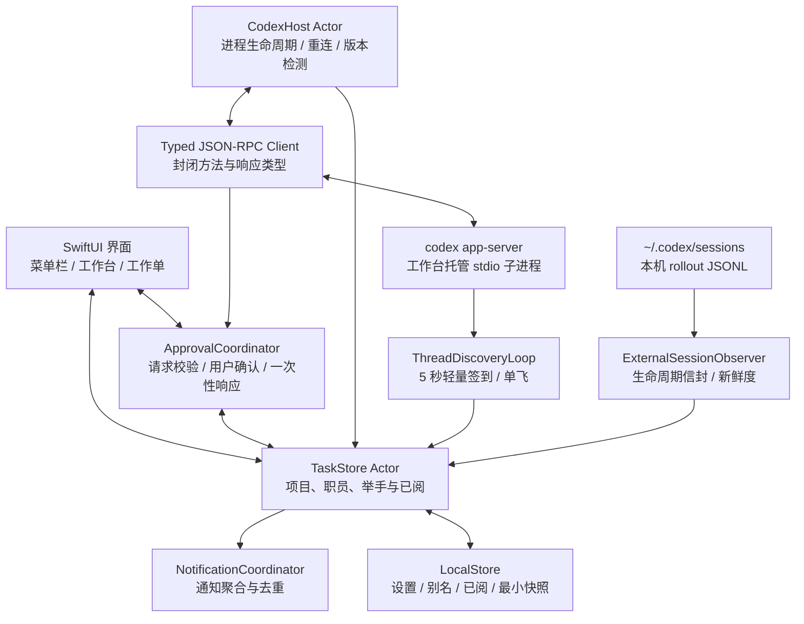
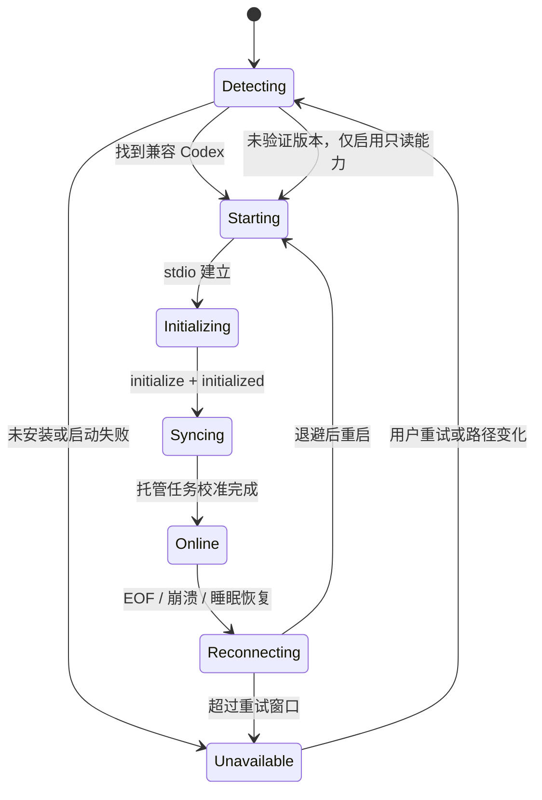

# Codex Monitor 技术架构

## 1. 架构结论

正式产品采用 **SwiftUI 原生 macOS 客户端 + 应用托管的 Codex App Server + 本机会话生命周期观察器**。Codex Monitor 启动并持有一个 `codex app-server --listen stdio://` 子进程；所有需要经理审批的任务都由这个 Server 创建或明确接管。其他本机 Codex 会话只读观察办理、完成、失败和中止。

MVP 明确分开两种来源：**`SERVER` 权威托管**与 **`OBSERVED` 只读观察**。不安装 Hook，不监听或注入 Codex Desktop 私有进程，也不把独立原生 Codex 会话伪装成可审批任务。观察器只解析 `~/.codex/sessions` 中的生命周期事件信封，不保存消息、工具输入、命令输出或 diff。

范围边界：

- 工作台创建或恢复的任务：实时状态、举手、审批和完成事件均为权威数据。
- Codex Desktop、IDE 或 CLI 独立启动的任务：有新鲜生命周期信号时进入办理/完成/失败/中止统计，并明确标记“其他 Codex 客户端（本机观察）”；没有新鲜信号时作为历史档案。
- 用户若要把历史任务交给工作台继续，需要执行显式“接管并继续”，由工作台调用 `thread/resume`，后续 turn 才属于当前 Server。

## 2. 为什么不需要 Hook

Codex App Server 本身已经提供 thread、turn、item、审批请求和最终结果事件，但 `thread/status` 是当前 App Server 实例的运行时状态；独立客户端中的任务在另一个实例通常只会显示 `notLoaded`。本项目用只读 rollout 生命周期观察补齐“是否正在办理”，而授权仍严格留在原实例，因此不需要 Hook。

项目不会：

- 创建或修改 `~/.codex/hooks.json`。
- 发布 Hook relay、collector 或后台监听器。
- 用 Hook 推断审批是否已经解决。
- 用 Hook 推送或修改全局 Codex 配置。

此前 Hook PoC 仅作为被否决路线的验证记录保留在 `docs/validation/`。

## 3. 官方接口事实

- App Server 是 Codex 面向富客户端的接口，覆盖认证、会话历史、审批和流式 agent 事件。
- 默认 stdio 传输使用逐行 JSON；它适合本机父子进程，不需要开放网络端口。
- 客户端必须先发送 `initialize`，再发送 `initialized`。
- `thread/start` 创建任务并自动订阅；`thread/resume` 加载历史任务并订阅后续事件。
- `thread/read` 只读历史，不会加载或订阅任务。
- `thread/status/changed`、`turn/*`、`item/*` 和 `serverRequest/resolved` 构成实时状态闭环。
- `thread/started` 属于当前 App Server 连接的生命周期通知，不能当作其他 Codex 客户端创建会话的跨进程广播。
- `thread/list` 的 `status` 只代表当前 App Server 实例；`notLoaded` 不能证明同一任务没有在其他 Codex 客户端运行。
- 命令、文件修改和权限请求以 Server 发起的 JSON-RPC request 到达客户端；客户端响应决策后，Server 继续执行并发出最终 item 状态。
- WebSocket 传输仍是实验接口，MVP 不使用。

官方说明：[Codex App Server](https://developers.openai.com/codex/app-server/)

## 4. 系统结构



托管数据路径为 `App Server → Typed RPC → TaskStore → UI/Notification`；审批响应沿相反方向回到同一个 Server request。外部会话先由 `thread/list` 的 State DB 轻量页发现 ID、标题、项目和来源，再由 `rollout 生命周期信封 → ExternalSessionObserver → TaskStore → UI` 判断运行与终态；该路径只读且没有审批回路。

后台发现在线时约每 5 秒读取最近 100 条，固定使用 `useStateDbOnly: true`，不扫描历史 JSONL。完整刷新与后台发现共享一个 single-flight，连接代次变化时丢弃旧响应；失败按 10、20、40、60 秒退避并保留最后有效卡片。最近页采用 partial merge，只新增未知 ID，不删除旧卡、也不覆盖已观察到的运行状态。启动、手动刷新和睡眠恢复使用 State DB 游标分页到末页，只有所有页面成功后才做完整校准，因此“全部会话”的统计不再受 200 条隐式上限影响。

## 5. macOS 模块划分

| 模块 | 类型 | 责任 | 明确不负责 |
|---|---|---|---|
| `CodexMonitorApp` | App | 生命周期、MenuBarExtra、窗口与依赖注入 | 解析 JSON-RPC |
| `DashboardFeature` | SwiftUI | 项目轨道、职员卡、搜索和筛选 | 直接访问进程 |
| `TaskComposerFeature` | SwiftUI | 选择项目并交办新任务 | 绕过权限策略 |
| `TaskDetailFeature` | SwiftUI | 状态、最小时间线、审批和结果摘要 | 展示完整推理内容 |
| `SettingsFeature` | SwiftUI | Codex 路径、通知、隐私、诊断 | 修改 Codex 全局配置 |
| `CodexHost` | Actor | 启停 App Server、握手、重连、退出保护 | 产品状态映射 |
| `CodexProtocol` | Swift package/target | 版本化 DTO、事件解码、请求 ID | UI 文案 |
| `ApprovalCoordinator` | Actor | 待处理请求、可用决策、幂等和超时 | 自动批准 |
| `TaskStore` | Actor + `@MainActor` facade | 快照、事件归并、派生状态和排序 | 保存完整聊天记录 |
| `NotificationCoordinator` | Service | 通知聚合、点击路由和去重 | 重复提醒已解决事项 |
| `LocalStore` | Service | 设置、别名、已阅游标和最小快照 | 保存 token 或 transcript |
| `Diagnostics` | Service | 版本、连接和脱敏日志 | 输出完整命令或绝对路径 |
| `ExternalSessionObserver` | Actor | 增量读取近期 rollout 生命周期、限制扫描窗口、收敛陈旧状态 | 返回消息、命令输出、diff 或发送审批 |

## 6. Server 所有权与生命周期

### 6.1 启动

1. 按用户设置、Codex.app 内置资源、Homebrew 和 `PATH` 候选顺序定位 `codex`。
2. 读取并校验版本，不通过 shell 拼接命令。
3. 用 `Process` 启动 `codex app-server --listen stdio://`。
4. 建立 stdin/stdout JSONL 管道，stderr 进入限长脱敏诊断。
5. 完成 `initialize` / `initialized`。
6. 获取工作台已登记任务的快照；仅对需要继续实时管理的任务执行 `thread/resume`。

### 6.2 常驻

关闭主窗口不会终止 Server，因为菜单栏应用仍在运行。App Server 异常退出时进入重连状态；重启后重新读取任务，并把没有最终事件的在途 turn 标记为“状态待核实”，不能直接显示完成。

### 6.3 退出

应用完全退出时，如果仍有 active turn，必须显示确认页：

- “返回工作台”保留任务继续运行。
- “中断并退出”逐个调用 `turn/interrupt`，等待最终事件后关闭 Server。
- 应用崩溃或被强制结束时不能保证在途任务继续，重启后必须校准状态。

MVP 不承诺独立于应用进程的后台 daemon。未来只有在当前安装提供官方托管 daemon 且多客户端语义经过验证后，才评估替换进程宿主。

## 7. 连接状态机



退避序列：0.5、1、2、4、8、15 秒，之后每 30 秒尝试一次。用户手动重试会先回收当前子进程，再执行完整握手；系统唤醒优先在现有连接上校准，失败后才重启。

## 8. RPC 权限模型

发送入口必须由封闭 Swift 类型表达，不能接受任意 method 字符串。

### 8.1 MVP 允许的客户端请求

- 初始化与能力协商：`initialize` / `initialized`。
- 模型和兼容信息：`model/list` 及必要的只读版本探测。
- 历史和状态：`thread/list`、`thread/read`、`thread/loaded/list`。
- 托管任务：`thread/start`、`thread/resume`、`thread/unsubscribe`。
- 执行：`turn/start`；退出保护时允许 `turn/interrupt`。
- 对当前连接收到的审批或用户输入 request 返回一次响应。

### 8.2 MVP 禁止

- `thread/delete`、`thread/archive`、`thread/rollback`、`thread/inject_items`。
- `thread/shellCommand`、`command/exec`、`process/*` 和 `fs/*`。
- `config/value/write`、`config/batchWrite`、账户和 marketplace 写操作。
- 未经产品设计的 `turn/steer`、`thread/fork` 和长期权限放宽。
- 对并非由当前连接收到、已经 resolved 或标识不匹配的 request 作答。
- 自动接受、默认接受或倒计时接受任何授权。

### 8.3 审批决策限制

MVP 只显示 Server request 明确提供的可用决策。默认提供“一次允许”“拒绝”“取消”；`acceptForSession` 和永久规则修改不进入 MVP。审批前显示操作类型、原因、项目、工作目录和经过安全折叠的命令或文件范围。

每次响应必须同时匹配：`requestId + threadId + turnId + itemId + connectionGeneration`。发送后立即把本地请求置为 `responding`，等待 `serverRequest/resolved` 或 `item/completed` 后才置为最终状态，避免双击和重连重复回答。所有客户端 request 都有 12 秒超时；超时或取消会释放本地 pending continuation。

## 9. 任务与审批事件映射

| Codex 信号 | 工作台动作 |
|---|---|
| `thread/started` | 登记一个工作台托管职员 |
| `thread/status/changed.active` | 显示“办理中”，解析 `activeFlags` |
| `turn/started` | 记录 active turn，启动持续时间 |
| `item/started` | 更新最近活动和最小时间线 |
| `item/commandExecution/requestApproval` | 创建“命令授权”举手 |
| `item/fileChange/requestApproval` | 创建“文件修改授权”举手 |
| `item/permissions/requestApproval` | 创建“网络/文件范围授权”举手 |
| `item/tool/requestUserInput` | 创建“需要经理补充信息”举手 |
| `serverRequest/resolved` | 撤下匹配的待处理请求，等待最终 item 校准 |
| `item/completed` | 用权威最终 item 状态纠正审批和工具状态 |
| `turn/completed.completed` | 创建完成未阅事项 |
| `turn/completed.failed` | 创建异常汇报并显示脱敏错误摘要 |
| `turn/completed.interrupted` | 显示已中断，不冒充失败或完成 |
| EOF / 解码错误 | 保留最后状态但标记过期，进入重连 |

事件键使用 `threadId + turnId + itemId/requestId + eventKind`，重复通知必须幂等。

## 10. 本地领域模型

```text
ProjectRecord
  id: hash(normalizedCwd)
  displayName: String
  cwdDisplay: RedactedPath
  taskIds: Set<ThreadID>
  counts: DerivedCounts

TaskRecord
  id: ThreadID
  sessionId: SessionID
  projectId: ProjectID
  title: String
  ownership: hostedLive | historyOnly
  rawStatus: RawCodexStatus
  displayStatus: DisplayStatus
  activeTurnId: TurnID?
  attention: [AttentionRecord]
  lastEventAt: Date?
  lastSnapshotAt: Date

AttentionRecord
  id: StableAttentionID
  kind: commandApproval | fileApproval | permissions | userInput | failure | completedUnseen
  state: open | responding | resolved | acknowledged | expired
  requestId: RequestID?
  itemId: ItemID?
  turnId: TurnID
  connectionGeneration: UInt64
  createdAt: Date
  resolvedAt: Date?
```

项目以规范化 `cwd` 分组。UI 默认只显示目录末级和项目别名，完整路径只在用户展开且隐私模式允许时显示。

## 11. 一致性规则

1. `item/completed` 和 `turn/completed` 等最终事件优先于中间状态。
2. `serverRequest/resolved` 只处理匹配 request id 的事项。
3. 一个 turn 的完成不能清除另一个 turn 的请求。
4. 断线后所有未解决请求先标记 `expired`；只有当前连接重新收到的 request 才能作答。
5. 重连后以 Server 快照和新事件重建状态，再合并本地“已阅”。
6. 本地已阅只影响工作台，不修改 Codex thread。
7. 非托管任务只有在最近 10 分钟仍有日志活动且最后生命周期为 `task_started` 时显示“办理中”；陈旧的未闭合日志必须回到档案。
8. 外部失败最多作为近期观察事件举手；旧失败和旧中止不得在应用重启后永久占据待处理区。
9. `OBSERVED` 状态不得生成审批按钮；授权必须回原 Codex 客户端，或由用户显式接管后开启新 turn。

## 12. 数据存储与隐私

只持久化：

- Codex 可执行文件选择、通知和隐私设置。
- 工作台托管 thread id、项目别名、职员别名和已阅游标。
- 通知去重键及过期时间。
- 带版本 envelope 的最小状态快照，7 天自动过期；旧 Alpha 数组格式会在首次读取时脱敏迁移。

禁止持久化：

- OpenAI 凭据、登录 token。
- 完整对话、推理内容、命令输出和文件 diff。
- 未脱敏绝对路径的诊断日志。
- App Server 原始事件的无限期副本。

## 13. 安全边界

- 仅使用本机 stdio，不监听公网、局域网或浏览器端口。
- 子进程使用固定 executable URL 和 argument 数组，不通过 shell 拼接输入。
- App Server 返回的标题、路径、命令和错误均作为不可信纯文本。
- 授权按钮必须来自当前 request 的 `availableDecisions`，不得自行扩展权限。
- 一次允许与长期允许在视觉上不可混淆；MVP 不提供长期允许。
- 所有审批动作写入本地最小审计：时间、匿名任务标识、决策类型和结果，不记录完整命令。
- 诊断包默认脱敏，导出前展示字段清单。

## 14. 性能预算

| 指标 | 目标 |
|---|---:|
| 冷启动到缓存界面 | < 1 秒 |
| 冷启动到 Server 在线 | < 3 秒 |
| 权威事件到 UI | P95 < 1 秒 |
| 审批点击到响应发送 | P95 < 200 ms |
| 100 个任务过滤/排序 | < 16 ms |
| 空闲 CPU | 平均 < 1% |
| 内存 | 目标 < 120 MB |
| 本地缓存 | 默认 < 20 MB |

## 15. 版本兼容策略

- 为每个支持的 Codex 版本生成并归档 JSON Schema，转换为显式 Swift DTO。
- 运行时记录 Codex 版本和初始化信息，但不记录敏感环境。
- 已验证版本启用托管、执行和审批；未知版本只允许历史读取并显示诊断。
- JSON 解码对未知字段宽容，对未知枚举保留 `.unknown(rawValue)`。
- 关键审批字段缺失时禁止响应，显示“当前版本无法安全处理此申请”。
- 兼容矩阵覆盖当前版本、前一支持版本和一次升级验证。

## 16. 技术验收标准

- [ ] 工作台托管任务可完成 start → turn → approval → resolved → completed 闭环。
- [x] 独立原生任务有新鲜生命周期信号时标记 `OBSERVED` 并进入状态统计，陈旧记录回到历史档案。
- [ ] RPC 类型系统和测试阻止所有未允许方法。
- [ ] 重复、乱序、迟到和跨连接审批不会造成重复或错误决策。
- [ ] App Server 重启、Mac 睡眠和应用重启后状态可恢复。
- [ ] 退出 active turn 前有明确确认，不静默终止。
- [ ] 未知 Codex 版本自动退化且界面可理解。
- [ ] 应用不读取、安装或依赖任何 Hook。
- [x] 生命周期观察器限制近期文件与尾部扫描范围，且不返回或持久化消息、命令输出和 diff。
- [ ] 默认日志和缓存不含凭据、完整命令、完整路径或完整对话。
