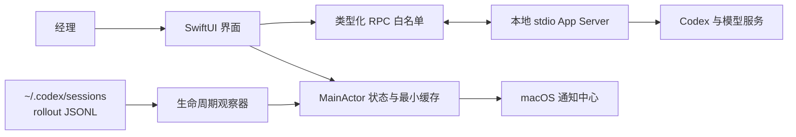

# Codex Monitor MVP 安全与隐私威胁模型

日期：2026-08-09  
范围：SwiftUI 本地客户端、应用托管的 stdio Codex App Server、本机会话生命周期观察器、任务状态、审批、通知与本地缓存。

## 1. 保护目标

1. 经理的决定只能回答当前 App Server 连接上、当前任务中的对应请求。
2. 工作台不能扩大 Codex 请求的权限，也不能自动或长期批准。
3. 任务标题、命令、路径、错误和 Server 消息一律按不可信文本处理。
4. 本地不保存凭据、完整对话、完整命令、工具输出或 diff。
5. 断线、重连、睡眠和未知版本不能把过期状态伪装成实时状态。

## 2. 信任边界

- `UI → RPC` 是写操作边界：只有封闭的 Swift enum 方法能够发送。
- `SERVER → UI` 是不可信输入边界：所有 JSON、标题、命令、路径和错误均只作数据展示。
- 本地缓存和通知是隐私边界：只允许最少标识与脱敏状态。
- `LOGS → OBS` 是只读观察边界：仅输出生命周期枚举和更新时间，不返回或持久化消息、工具输入、命令输出和 diff；初次扫描限制为近期文件的尾部窗口。
- 不存在 HTTP/WebSocket listener，不存在 Hook 或全局 Codex 配置写入。

## 3. 威胁与控制

| ID | 威胁 | 风险 | 已实现控制 | 验证 |
|---|---|---:|---|---|
| T-01 | 任意 RPC 方法被拼接发送 | 极高 | `AllowedClientMethod`/`AllowedClientNotification` 封闭枚举；无公开字符串发送入口 | 白名单单测与静态检查 |
| T-02 | 授权答错任务或旧连接 | 极高 | request id、thread、turn、item、连接代次绑定；旧代次过期 | 状态机单测 |
| T-03 | 双击或重复响应 | 高 | 首次点击先转为 `responding`；只有 `open` 可提交 | 重复提交单测 |
| T-04 | 自动或长期批准 | 极高 | 仅支持 `accept`、`decline`、`cancel`；没有 `acceptForSession`、策略写入或倒计时批准 | schema 审阅与白名单测试 |
| T-05 | 未知 Server request 诱导能力扩张 | 高 | 未识别请求返回 JSON-RPC 错误，不创建按钮 | 路由单测 |
| T-06 | 未知 Codex 版本破坏协议 | 高 | 0.142–0.144 为验证基线；其他版本只读，不 resume/start/approve | 版本策略单测 |
| T-07 | App Server 无响应造成界面永久挂起 | 中 | 每个客户端请求 12 秒超时，取消会释放 pending continuation | 静默 Server 超时测试 |
| T-08 | 恶意标题/命令触发执行 | 高 | SwiftUI `Text` 纯文本呈现；命令和路径默认折叠；不生成可点击 shell/URL | 人工 UI 检查 |
| T-09 | 日志泄露用户路径或无限增长 | 高 | stderr 32 KiB 上限；常见绝对路径替换为 `<path>`；诊断不含 stdout 消息体 | 诊断检查 |
| T-10 | 缓存泄露对话或审批详情 | 高 | 只保存托管 thread id、设置、已阅与脱敏任务快照；清空绝对路径、分支、active turn、preview、summary、attentions，隐私模式下替换标题 | 缓存实现检查 |
| T-11 | 通知泄露敏感内容 | 中 | 通知只含职员名、项目末级名和状态；不含命令、绝对路径或对话 | 通知实现检查 |
| T-12 | 伪造或陈旧的外部实时状态 | 高 | 非托管状态明确标记 `OBSERVED`；办理信号 10 分钟过期；旧失败/中止回档；最终生命周期优先 | 状态机与真实状态对账 |
| T-13 | 项目路径别名造成错分组 | 中 | 路径标准化并解析现有符号链接；交办前验证是现存目录 | 路径单测 |
| T-14 | App 退出遗留在途任务 | 高 | 运行、审批和补充信息任务均触发退出确认；用户选择后逐个 interrupt | 原生 UI 检查 |
| T-15 | 观察器暴露会话内容或造成高 I/O | 高 | 只匹配 lifecycle envelope；Actor 增量偏移；只扫描两小时内文件且初始尾部最多 4 MiB；不写缓存 | 观察器单测与代码检查 |

## 4. 数据清单

持久化：

- 用户选择的 Codex 可执行文件路径。
- 托管 thread id。
- 通知开关、隐私模式和完成已阅状态。
- 不含 preview、summary、attention 的最小任务快照。
- 最多 100 条审批摘要：时间、短工号、请求类型、动作与发送结果，不含请求内容。

不持久化：

- OpenAI/Codex 凭据或 token。
- 完整对话、推理内容、命令、工具输出和 diff。
- Server 原始事件流或 stdout。
- 审批请求的敏感 payload。

用户可在“设置与诊断”中一键清除工作台本地数据；该操作不删除 Codex 任务和项目文件。

## 5. 版本与审批策略

- 已生成并保存 Codex CLI 0.142.2 与 0.144.1 的 App Server schema。
- 0.142–0.144 作为当前兼容窗口；未来版本默认只读。
- `item/tool/requestUserInput` 需要 `experimentalApi` 能力；其余任务与审批链路采用版本化 App Server API。
- 权限请求只可回传用户当前点击的一次性 turn 范围，不提供 session scope。

## 6. 剩余发布风险

以下项目不是本地 Alpha 的代码缺陷，但在公开发布前仍是阻断项：

- 使用真实模型完成允许、拒绝、取消、补充信息、失败和中断 E2E；该测试可能产生模型用量，默认关闭。
- 多 Codex 版本、最低 macOS、睡眠/唤醒和 8 小时长稳矩阵。
- Developer ID 签名、公证、分发、更新与回滚演练。
- 独立安全复核和真实用户 Beta。

若增加自动批准、长期权限、远程连接、云同步、Hook 或任意 RPC，必须重新进行威胁建模并提交新的 ADR。
